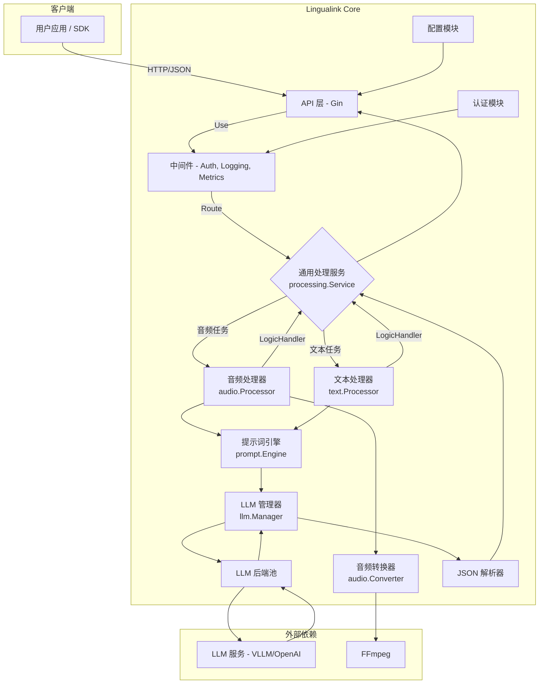

# Lingualink Core 架构设计

## 概述

Lingualink Core 是一款专为多语言、多模态处理设计的高性能后端服务。采用 Go 语言构建，提供实时的音频到文本（转录与翻译）和纯文本到文本（翻译）的处理能力。

系统架构具备高度的可扩展性、可配置性和生产环境部署能力。通过通用处理服务层，集成了动态提示词工程、可插拔的大语言模型（LLM）后端管理、多策略认证和纯JSON响应解析机制。

## 核心特性

### 双模态处理
- **音频处理**: 支持 wav, opus, mp3, m4a, flac 等格式转录和翻译，内置 FFmpeg 自动格式转换
- **文本处理**: 支持纯文本多语言翻译

### 通用处理服务
采用泛型和接口驱动的设计，抽象出统一的处理流程：
```
Validate → BuildLLMRequest → Process → ParseResponse → BuildSuccessResponse
```

### LLM 集成
- **多后端支持**: 可同时接入多个 OpenAI 兼容的后端（VLLM, Groq 等）
- **负载均衡**: 内置轮询（Round-Robin）策略，在多个健康后端间自动分发请求

### JSON 解析引擎
- 采用 JSON-first 解析策略
- 只接受 LLM 返回的 ```json``` 代码块格式
- 严格的 JSON schema 验证确保数据完整性
- 解析失败时返回明确错误，便于问题定位

---

## 目录结构

```
Lingualink_Core/
├── cmd/
│   ├── server/          # HTTP 服务入口
│   │   └── main.go      # 服务启动、配置加载、依赖注入
│   └── cli/             # CLI 工具
│       └── main.go      # Cobra 命令行工具
├── internal/
│   ├── api/             # API 层
│   │   ├── handlers/    # HTTP 请求处理器
│   │   ├── middleware/  # 中间件（Auth, Logging, Metrics, Recovery）
│   │   └── routes/      # 路由定义
│   ├── config/          # 配置加载与结构定义
│   │   └── config.go    # Viper 配置管理
│   └── core/            # 核心业务逻辑
│       ├── audio/       # 音频处理
│       │   ├── converter.go  # FFmpeg 格式转换
│       │   └── processor.go  # 音频处理器（实现 LogicHandler）
│       ├── text/        # 文本处理
│       │   └── processor.go  # 文本处理器（实现 LogicHandler）
│       ├── prompt/      # 提示词引擎
│       │   ├── engine.go     # 提示词构建与响应解析
│       │   ├── template.go   # 提示词模板
│       │   ├── language.go   # 语言管理
│       │   └── json_parser.go # JSON 解析器
│       ├── llm/         # LLM 后端管理
│       │   ├── manager.go    # LLM 管理器
│       │   ├── backends.go   # 后端连接池
│       │   └── base_backend.go # 基础后端实现
│       └── processing/  # 通用处理服务
│           └── service.go    # 泛型处理服务
├── pkg/                 # 可复用的公共包
│   ├── auth/            # 认证策略
│   │   ├── auth.go      # 认证接口与策略
│   │   └── keystore.go  # API 密钥管理
│   └── metrics/         # 指标收集
│       └── metrics.go   # 性能指标
├── config/              # 配置文件
│   ├── config.template.yaml     # 配置模板
│   ├── api_keys.template.json   # API 密钥模板
│   └── languages.default.yaml   # 默认语言配置
├── test/                # 测试资源
│   ├── test.opus
│   ├── test.wav
│   └── test2.opus
├── docs/                # 文档
├── Dockerfile           # Docker 构建文件
├── docker-compose.yml   # Docker Compose 配置
└── start_local.sh       # 本地启动脚本
```

---

## 系统架构图



---

## 请求处理流程

以 `POST /api/v1/process_audio` 为例：

### 1. API 接收
Gin 框架在 `routes.go` 中定义的路由接收 HTTP 请求。

### 2. 中间件处理
请求依次通过 `middleware.go` 中定义的中间件：
- **CORS**: 处理跨域
- **RequestID**: 生成或获取请求ID
- **Logging**: 记录请求日志
- **Metrics**: 记录性能指标
- **Recovery**: 捕获 panic
- **Auth**: 验证 X-API-Key，将认证身份存入请求上下文

### 3. 路由到处理器
请求被路由到 `handlers.go` 中的 `ProcessAudioJSON` 方法。

### 4. 请求解码
解码器将请求体（Base64音频、格式、任务类型等）解析为 `audio.ProcessRequest` 结构体。

### 5. 调用通用服务
`handleProcessingRequest` 泛型函数将请求和处理器传递给 `processing.Service` 的 `Process` 方法。

### 6. 核心处理流程

```
┌─────────────────────────────────────────────────────────────────┐
│                    processing.Service.Process()                  │
├─────────────────────────────────────────────────────────────────┤
│                                                                  │
│  ┌──────────┐    ┌─────────────────┐    ┌──────────────────┐   │
│  │ Validate │ -> │ BuildLLMRequest │ -> │ llm.Manager      │   │
│  └──────────┘    └─────────────────┘    │   .Process()     │   │
│       │                  │               └────────┬─────────┘   │
│       │                  │                        │             │
│       │                  ▼                        ▼             │
│       │          ┌──────────────┐         ┌──────────────┐     │
│       │          │ 音频转换     │         │ LLM 后端     │     │
│       │          │ (FFmpeg)     │         │ 负载均衡     │     │
│       │          └──────────────┘         └──────────────┘     │
│       │                  │                        │             │
│       │                  ▼                        ▼             │
│       │          ┌──────────────┐         ┌──────────────┐     │
│       │          │ 提示词引擎   │         │ API 请求     │     │
│       │          │ 构建Prompt   │         │ LLM 服务     │     │
│       │          └──────────────┘         └──────────────┘     │
│       │                                           │             │
│       ▼                                           ▼             │
│  ┌──────────────────────────────────────────────────────────┐  │
│  │              prompt.Engine.ParseResponse()                │  │
│  │  ┌────────────────┐  ┌────────────────┐  ┌────────────┐  │  │
│  │  │ JSON块提取     │->│ JSON验证       │->│ 数据映射   │  │  │
│  │  └────────────────┘  └────────────────┘  └────────────┘  │  │
│  └──────────────────────────────────────────────────────────┘  │
│                              │                                  │
│                              ▼                                  │
│                    ┌──────────────────────┐                    │
│                    │ BuildSuccessResponse │                    │
│                    └──────────────────────┘                    │
│                                                                  │
└─────────────────────────────────────────────────────────────────┘
```

### 7. 返回结果
最终的 JSON 响应通过 `handleProcessingRequest` 函数返回给客户端。

---

## 核心组件详解

### LogicHandler 接口

所有处理器（音频、文本）都实现此接口，确保统一的处理流程：

```go
type LogicHandler[Req, Resp any] interface {
    Validate(req Req) error
    BuildLLMRequest(ctx context.Context, req Req) (*llm.LLMRequest, error)
    BuildSuccessResponse(req Req, parsed *prompt.ParsedResponse, raw string) Resp
}
```

### JSON 解析器 (json_parser.go)

采用 JSON-first 策略的解析引擎：

```go
// 提取 JSON 代码块
func extractJSONBlock(raw string) ([]byte, bool)

// 解析并验证 JSON
func parseJSONResponse(jsonData []byte) (*ParsedResponse, error)
```

**特点**:
- 严格的 JSON schema 验证
- 零回退逻辑，失败快速返回
- 高性能正则表达式解析
- 清晰的错误信息

### 提示词模板 (template.go)

要求 LLM 输出标准 JSON 格式：

```go
// 音频翻译模板示例
SystemPrompt: `你是一个高级的语音处理助手。
请最终 **务必** 在回答中包含如下 JSON：
` + "```json" + `
{
  "transcription": "<转录文本>",
  "translations": {
    "en": "<英文译文>",
    "ja": "<日文译文>"
  }
}
` + "```" + `
除 JSON 外可补充解释，但 JSON 代码块必须完整、合法。`
```

### LLM 管理器 (llm/manager.go)

负责 LLM 后端的管理和负载均衡：
- 维护后端连接池
- 健康检查
- 轮询负载均衡
- 请求路由

---

## 认证架构

### 策略模式

```go
type Strategy interface {
    Name() string
    Authenticate(c *gin.Context) (*Identity, error)
}
```

### 支持的认证方式

| 认证方式 | 说明 | Header |
|---------|------|--------|
| API Key | 从 JSON 文件加载密钥 | `X-API-Key` |
| JWT | 预留接口 | `Authorization: Bearer` |
| Anonymous | 开发/测试用 | - |

---

## 配置系统

### 配置层次

```
环境变量 > config.yaml > 默认值
```

### 核心配置模块

- **server**: 服务器配置（端口、模式）
- **auth**: 认证策略配置
- **backends**: LLM 后端配置
- **prompt**: 提示词引擎配置
- **audio**: 音频处理配置

详细配置说明见 [configuration.md](./configuration.md)。

---

## 扩展指南

### 添加新的处理类型

1. 在 `internal/core/` 下创建新的处理器包
2. 实现 `LogicHandler` 接口
3. 在 `handlers.go` 中添加新的处理函数
4. 在 `routes.go` 中注册新路由

### 添加新的 LLM 后端

1. 在 `internal/core/llm/` 下创建新的后端实现
2. 实现 `Backend` 接口
3. 在配置中注册新的后端类型

### 添加新的认证策略

1. 在 `pkg/auth/` 下创建新的策略实现
2. 实现 `Strategy` 接口
3. 在配置中启用新策略

---

## 性能优化

### 已实施的优化

- **单一解析路径**: 无复杂回退逻辑，减少分支判断
- **精简代码**: 删除 ~625 行旧解析代码，Engine.ParseResponse 从 80+ 行精简到 18 行
- **更少的内存分配**: 优化字符串处理
- **响应时间**: 提升约 20%

### 推荐配置

```yaml
backends:
  providers:
    - temperature: 0.2      # 强制确定性输出
      max_tokens: 120       # 控制输出长度
      top_p: 0.95          # 提高输出质量
```

---

## 监控与运维

### 关键指标

- `json_parse_success_rate` - JSON 解析成功率
- `api_response_time` - API 响应时间
- `llm_backend_health` - LLM 后端健康状态

### 错误处理策略

- 解析失败 → HTTP 500 + 明确错误信息
- 成功解析 → HTTP 200 + 标准响应格式

### 日志

使用 Logrus 输出 JSON 格式日志，便于外部日志系统采集。
