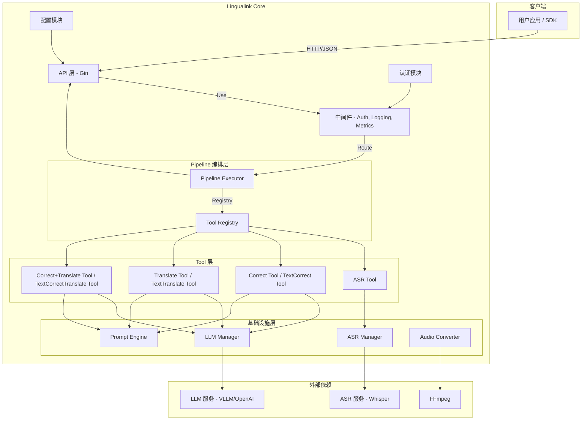

# Lingualink Core 架构设计

## 概述

Lingualink Core 是一款专为多语言、多模态处理设计的高性能后端服务。采用 Go 语言构建，提供实时的音频到文本（转录与翻译）和纯文本到文本（翻译）的处理能力。

系统采用 **Tool Use + Pipeline** 架构，将各处理步骤抽象为独立可组合的 Tool，通过 Pipeline 编排执行。这种设计提供了高度的可扩展性、可测试性和灵活性。

## 核心特性

### 双模态处理
- **音频处理**: 支持 wav, opus, mp3, m4a, flac 等格式转录和翻译，内置 FFmpeg 自动格式转换
- **文本处理**: 支持纯文本多语言翻译

### Tool Use 架构
系统采用模块化的 Tool 设计：
- **Tool 接口**: 统一的可执行处理单元抽象
- **Pipeline 编排**: 预定义或动态组合 Tool 序列
- **独立可测**: 每个 Tool 独立开发、测试、部署

### LLM 集成
- **多后端支持**: 可同时接入多个 OpenAI 兼容的后端（VLLM, Groq 等）
- **Tool Calling**: 支持 LLM Function Calling 模式
- **负载均衡**: 内置轮询（Round-Robin）策略

### 独立 ASR 服务
- 支持 Whisper 兼容的 ASR 后端
- 与 LLM 服务解耦，可独立扩展

---

## 目录结构

```
Lingualink_Core/
├── cmd/
│   ├── server/              # HTTP 服务入口
│   │   └── main.go          # 服务启动、配置加载、依赖注入
│   └── cli/                 # CLI 工具
│       └── main.go          # Cobra 命令行工具
├── internal/
│   ├── api/                 # API 层
│   │   ├── handlers/        # HTTP 请求处理器
│   │   │   ├── handlers.go  # Handler 结构 + 构造函数
│   │   │   ├── helpers.go   # 通用处理流程与错误响应
│   │   │   ├── audio.go     # 音频相关 endpoints
│   │   │   ├── text.go      # 文本相关 endpoints
│   │   │   ├── health.go    # 健康检查
│   │   │   ├── admin.go     # 管理/能力信息
│   │   │   └── status.go    # 状态查询
│   │   ├── middleware/      # 中间件（Auth, Logging, Metrics, Recovery）
│   │   └── routes/          # 路由定义
│   ├── config/              # 配置加载与结构定义
│   │   ├── config.go        # 加载/合并配置（Viper）
│   │   ├── defaults.go      # 默认值
│   │   ├── types.go         # 配置结构体
│   │   ├── validation.go    # 配置校验与规范化
│   │   ├── watcher.go       # 配置热重载（可选）
│   │   └── pipeline.go      # Pipeline 配置结构
│   └── core/                # 核心业务逻辑
│       ├── asr/             # ASR 服务管理
│       │   ├── manager.go   # ASR 后端管理器
│       │   └── whisper.go   # Whisper 兼容后端
│       ├── audio/           # 音频处理
│       │   ├── converter.go             # 转换器入口
│       │   ├── converter_ffmpeg.go      # FFmpeg 调用封装
│       │   ├── converter_validation.go  # 音频数据校验
│       │   ├── converter_stats.go       # 转换统计
│       │   ├── processor.go             # Processor 结构 + ProcessDirect
│       │   ├── pipeline_select.go       # pipeline 选择
│       │   ├── response.go              # pipeline 响应构建
│       │   ├── types.go                 # 请求/响应类型
│       │   └── validation.go            # 请求校验
│       ├── tool/            # Tool 实现 ★
│       │   ├── tool.go      # Tool 接口定义
│       │   ├── registry.go  # Tool 注册表
│       │   ├── types.go     # Input/Output 类型
│       │   ├── asr_tool.go  # ASR Tool
│       │   ├── correct_tool.go                  # 纠错 Tool（音频链路）
│       │   ├── translate_tool.go                # 翻译 Tool（音频链路）
│       │   ├── correct_translate_tool.go        # 纠错+翻译合并 Tool（音频链路）
│       │   ├── text_correct_tool.go             # 纠错 Tool（文本链路）
│       │   ├── text_translate_tool.go           # 翻译 Tool（文本链路）
│       │   └── text_correct_translate_tool.go   # 纠错+翻译 Tool（文本链路）
│       ├── pipeline/        # Pipeline 编排 ★
│       │   ├── pipeline.go  # Pipeline 定义
│       │   ├── executor.go  # Pipeline 执行器
│       │   ├── predefined.go      # 音频预定义 Pipeline
│       │   └── text_predefined.go # 文本预定义 Pipeline
│       ├── prompt/          # 提示词引擎
│       │   ├── engine.go    # 提示词构建
│       │   ├── template.go  # 提示词模板
│       │   └── language.go  # 语言管理
│       ├── llm/             # LLM 后端管理
│       │   ├── manager.go   # LLM 管理器
│       │   ├── backends.go  # 后端连接池
│       │   └── tool_calling.go # Tool Calling 支持
│       ├── text/            # 文本处理
│       └── processing/      # 通用处理服务
├── pkg/                     # 可复用的公共包
│   ├── auth/                # 认证策略
│   └── metrics/             # 指标收集
├── config/                  # 配置文件
│   ├── config.template.yaml
│   └── api_keys.template.json
├── test/                    # 测试资源
├── docs/                    # 文档
├── Dockerfile
├── docker-compose.yml
└── start_local.sh
```

---

## 系统架构图



---

## Tool Use 架构详解

### Tool 接口

所有处理单元都实现统一的 `Tool` 接口：

```go
type Tool interface {
    // Name 返回工具的唯一标识符
    Name() string
    
    // Description 返回工具描述（用于 LLM Tool Calling）
    Description() string
    
    // Schema 返回输入 JSON Schema
    Schema() map[string]interface{}
    
    // OutputSchema 返回输出 JSON Schema（用于 LLM function parameters）
    OutputSchema() map[string]interface{}
    
    // Validate 验证输入参数
    Validate(input Input) error
    
    // Execute 执行工具并返回结果
    Execute(ctx context.Context, input Input) (Output, error)
}
```

### 已实现的 Tools

| Tool | 名称 | 功能 | 依赖 |
|------|------|------|------|
| `ASRTool` | `asr` | 语音转文字 | ASR Manager |
| `CorrectTool` | `correct` | 文本纠错 | LLM Manager |
| `TranslateTool` | `translate` | 文本翻译 | LLM Manager |
| `CorrectTranslateTool` | `correct_translate` | 纠错+翻译（合并） | LLM Manager |
| `TextCorrectTool` | `text_correct` | 文本纠错（文本链路） | LLM Manager |
| `TextTranslateTool` | `text_translate` | 文本翻译（文本链路） | LLM Manager |
| `TextCorrectTranslateTool` | `text_correct_translate` | 纠错+翻译（文本链路） | LLM Manager |

### Tool Registry

```go
type Registry struct {
    tools map[string]Tool
}

func (r *Registry) Register(t Tool)
func (r *Registry) Get(name string) (Tool, bool)
func (r *Registry) List() []Tool
```

### Input/Output 结构

```go
type Input struct {
    Data    map[string]interface{}  // 工具输入数据
    Context *PipelineContext        // Pipeline 上下文
}

type Output struct {
    Data     map[string]interface{}  // 工具输出数据
    Metadata map[string]interface{}  // 元数据（耗时、模型等）
}

type PipelineContext struct {
    RequestID       string
    OriginalRequest map[string]interface{}
    StepOutputs     map[string]Output       // 各步骤输出
    Metrics         map[string]time.Duration
}
```

---

## Pipeline 编排

### Pipeline 定义

```go
type Step struct {
    ToolName     string            // 工具名称
    InputMapping map[string]string // 输入映射规则
    OutputKey    string            // 输出存储键名
}

type Pipeline struct {
    Name  string
    Steps []Step
}
```

### 预定义 Pipeline

| Pipeline | 步骤 | 用途 |
|----------|------|------|
| `transcribe` | ASR | 仅转录 |
| `transcribe_correct` | ASR → Correct | 转录+纠错 |
| `translate` | ASR → Translate | 转录+翻译（无纠错） |
| `translate_merged` | ASR → CorrectTranslate | 转录+纠错翻译（合并） |
| `translate_split` | ASR → Correct → Translate | 转录+纠错+翻译（分离） |
| `text_translate` | TextTranslate | 纯文本翻译 |
| `text_correct` | TextCorrect | 纯文本纠错 |
| `text_correct_translate` | TextCorrectTranslate | 纠错+翻译（合并） |
| `text_correct_then_translate` | TextCorrect → TextTranslate | 纠错+翻译（分离） |
| `text_passthrough` | Passthrough | 直接返回原文本（不调用 LLM） |

### Pipeline 执行器

```go
type Executor struct {
    registry *tool.Registry
}

func (e *Executor) Execute(ctx context.Context, p Pipeline, pctx *PipelineContext) (*PipelineContext, error) {
    for _, step := range p.Steps {
        // 1. 从 Registry 获取 Tool
        t := e.registry.Get(step.ToolName)
        
        // 2. 解析输入映射（如 "asr_result.text" → 获取 ASR 输出的 text 字段）
        input := resolveInputMapping(step.InputMapping, pctx)
        
        // 3. 执行 Tool
        output := t.Execute(ctx, input)
        
        // 4. 存储输出到上下文
        pctx.StepOutputs[step.OutputKey] = output
    }
    return pctx, nil
}
```

### 输入映射表达式

支持路径表达式从上下文获取数据：

```yaml
# 从原始请求获取
"request.audio"           → 原始音频数据
"request.target_languages" → 目标语言列表

# 从前一步骤输出获取
"asr_result.text"         → ASR 输出的文本
"correct_result.corrected_text" → 纠错后的文本
```

---

## 请求处理流程

以 `POST /api/v1/process_audio` (translate 任务) 为例：

同理，`POST /api/v1/process_text` 会根据 `task` 与 `correction` 配置选择 `text_*` Pipeline（不经过 ASR 步骤），并在响应 `metadata` 中返回 `pipeline` 与 `step_durations_ms`。

```
┌───────────────────────────────────────────────────────────────────────────┐
│                           请求处理流程                                      │
├───────────────────────────────────────────────────────────────────────────┤
│                                                                            │
│  1. HTTP 请求                                                              │
│     ┌──────────────────────────────────────────────────────────────────┐  │
│     │ POST /api/v1/process_audio                                        │  │
│     │ { audio, audio_format, task: "translate", target_languages }     │  │
│     └──────────────────────────────────────────────────────────────────┘  │
│                              │                                             │
│                              ▼                                             │
│  2. 中间件处理: CORS → RequestID → Logging → Auth → Metrics              │
│                              │                                             │
│                              ▼                                             │
│  3. 选择 Pipeline                                                          │
│     ┌─────────────────────────────────────────────────────────────────┐   │
│     │ if correction.enabled && correction.merge_with_translation:     │   │
│     │     → translate_merged                                           │   │
│     │ elif correction.enabled:                                         │   │
│     │     → translate_split                                            │   │
│     │ else:                                                            │   │
│     │     → translate                                                  │   │
│     └─────────────────────────────────────────────────────────────────┘   │
│                              │                                             │
│                              ▼                                             │
│  4. Pipeline 执行 (以 translate_merged 为例)                               │
│     ┌─────────────────────────────────────────────────────────────────┐   │
│     │                                                                  │   │
│     │  Step 1: ASR Tool                                               │   │
│     │  ┌─────────────────────────────────────────────────────────┐   │   │
│     │  │ Input:  { audio, format, language }                      │   │   │
│     │  │ Output: { text, language, duration, segments }           │   │   │
│     │  └─────────────────────────────────────────────────────────┘   │   │
│     │                          │                                      │   │
│     │                          ▼                                      │   │
│     │  Step 2: CorrectTranslate Tool                                 │   │
│     │  ┌─────────────────────────────────────────────────────────┐   │   │
│     │  │ Input:  { text: asr_result.text, target_languages }      │   │   │
│     │  │ Output: { corrected_text, translations }                 │   │   │
│     │  └─────────────────────────────────────────────────────────┘   │   │
│     │                                                                  │   │
│     └─────────────────────────────────────────────────────────────────┘   │
│                              │                                             │
│                              ▼                                             │
│  5. 构建响应                                                               │
│     ┌──────────────────────────────────────────────────────────────────┐  │
│     │ { request_id, status, transcription, translations, metadata }    │  │
│     └──────────────────────────────────────────────────────────────────┘  │
│                                                                            │
└───────────────────────────────────────────────────────────────────────────┘
```

---

## LLM Tool Calling

### 配置

```yaml
pipeline:
  tool_calling:
    enabled: true          # 启用 Tool Calling（否则用 JSON 块）
    allow_thinking: false  # 是否允许 LLM 输出思考文本
```

### 工作模式

当 `tool_calling.enabled: true` 时：
1. LLM 通过 Function Calling 返回结构化数据
2. 使用 Tool 的 `OutputSchema()` 定义 function parameters
3. 自动解析 `tool_calls` 响应

当 `tool_calling.enabled: false` 时：
1. 使用传统 JSON 代码块格式
2. 通过提示词要求 LLM 输出 ```json``` 块
3. 正则提取并解析 JSON

---

## 核心组件

### ASR Manager

独立的语音识别服务管理：

```go
type Manager struct {
    providers []*whisper.Backend
    balancer  LoadBalancer
}

func (m *Manager) Transcribe(ctx context.Context, req *ASRRequest) (*ASRResponse, error)
```

### LLM Manager

多后端 LLM 服务管理：

```go
type Manager struct {
    providers []*Backend
    balancer  LoadBalancer
}

func (m *Manager) Process(ctx context.Context, req *LLMRequest) (*LLMResponse, error)
func (m *Manager) ProcessWithToolCalling(ctx context.Context, req *LLMRequest, tools []ToolDef) (*LLMResponse, error)
```

### Prompt Engine

动态提示词构建：
- 根据任务类型选择模板
- 注入目标语言列表
- 支持趣味语言风格注入（如猫娘语）

---

## 认证架构

### 策略模式

```go
type Strategy interface {
    Name() string
    Authenticate(c *gin.Context) (*Identity, error)
}
```

### 支持的认证方式

| 认证方式 | 说明 | Header |
|---------|------|--------|
| API Key | 从 JSON 文件加载密钥 | `X-API-Key` |
| Anonymous | 开发/测试用 | - |

---

## 配置系统

### 配置层次

```
环境变量 > config.yaml > 默认值
```

### 核心配置模块

| 模块 | 说明 |
|------|------|
| `server` | 服务器配置（端口、模式）|
| `auth` | 认证策略配置 |
| `asr` | ASR 后端配置 |
| `backends` | LLM 后端配置 |
| `correction` | 纠错配置 |
| `pipeline` | Pipeline 配置 |
| `prompt` | 提示词引擎配置 |

详细配置说明见 [configuration.md](./configuration.md)。

---

## 扩展指南

### 添加新的 Tool

1. 在 `internal/core/tool/` 下创建新文件
2. 实现 `Tool` 接口的所有方法
3. 在服务启动时注册到 Registry

```go
// my_tool.go
type MyTool struct { ... }

func (t *MyTool) Name() string { return "my_tool" }
func (t *MyTool) Execute(ctx context.Context, input Input) (Output, error) { ... }

// 注册
registry.Register(NewMyTool(...))
```

### 添加新的 Pipeline

在 `predefined.go` 中添加新的 Pipeline 定义：

```go
func MyCustomPipeline() Pipeline {
    return Pipeline{
        Name: "my_custom",
        Steps: []Step{
            {ToolName: "asr", InputMapping: ..., OutputKey: "asr_result"},
            {ToolName: "my_tool", InputMapping: ..., OutputKey: "my_result"},
        },
    }
}
```

### 添加新的 LLM 后端

1. 在 `internal/core/llm/` 下创建新的后端实现
2. 实现 `Backend` 接口
3. 在配置中注册新的后端类型

### 添加新的认证策略

1. 在 `pkg/auth/` 下创建新的策略实现
2. 实现 `Strategy` 接口
3. 在配置中启用新策略

---

## 监控与运维

### 关键指标

| 指标 | 说明 |
|------|------|
| `pipeline_step_duration` | 各 Pipeline 步骤耗时 |
| `tool_execution_count` | Tool 执行次数 |
| `asr_latency` | ASR 请求延迟 |
| `llm_latency` | LLM 请求延迟 |
| `api_response_time` | API 总响应时间 |

### 错误处理

- Tool 执行失败 → 返回具体错误信息
- Pipeline 中断 → 返回失败步骤位置
- LLM 服务不可用 → 降级或重试

### 日志

使用 Logrus 输出 JSON 格式日志，包含：
- `request_id`: 请求追踪 ID
- `pipeline`: 执行的 Pipeline 名称
- `step`: 当前执行步骤
- `duration`: 各步骤耗时
