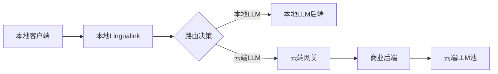

# Lingualink 生态系统架构设计文档

## 1. 总体架构概述

### 1.1 架构愿景
构建一个模块化、可扩展的音频处理生态系统，既支持开源社区的本地化部署需求，又能无缝集成商业化服务，实现技术开放与商业可持续的平衡。

### 1.2 核心设计原则
- **关注点分离**：技术核心与商业逻辑严格分离
- **接口标准化**：统一的API设计语言和通信协议
- **部署灵活性**：支持本地、云端、混合部署
- **横向扩展性**：商业后端可集成多个功能服务
- **向后兼容性**：API演进不破坏现有集成

### 1.3 系统组件全景

```
┌─────────────────────────────────────────────────────────────────┐
│                          用户端                                   │
├─────────────────┬─────────────────┬─────────────────────────────┤
│   WPF客户端     │   Web前端       │      移动端App              │
│  (开源)         │  (商业)         │      (商业)                 │
└────────┬────────┴────────┬────────┴────────┬────────────────────┘
         │                 │                 │
         │      ┌──────────▼─────────────────▼───────────┐
         │      │         商业API网关 (Kong/Nginx)        │
         │      │    - 统一认证/路由/限流/监控            │
         │      └──────────┬─────────────────────────────┘
         │                 │
         │      ┌──────────▼─────────────────────────────┐
         │      │         商业后端 (闭源)                 │
         │      │    - 用户管理/支付/计费/配额           │
         │      │    - 服务编排/路由分发                 │
         │      └────┬──────────┬──────────┬─────────────┘
         │           │          │          │
┌────────▼───────────▼──┐  ┌───▼────┐  ┌──▼──────────┐
│ Lingualink Core (Go)  │  │ 功能   │  │   其他      │
│   - 音频处理          │  │ 服务B  │  │  功能服务   │
│   - LLM路由           │  └────────┘  └─────────────┘
│   - 开源/本地部署     │
└───────────────────────┘
```

## 2. Lingualink Core (开源Go后端) 详细设计

### 2.1 模块架构

```go
lingualink-core/
├── cmd/
│   ├── server/          # HTTP服务启动入口
│   └── cli/             # 命令行工具
├── internal/
│   ├── api/             # API层
│   │   ├── handlers/    # HTTP处理器
│   │   ├── middleware/  # 中间件
│   │   └── routes/      # 路由定义
│   ├── core/            # 核心业务逻辑
│   │   ├── audio/       # 音频处理
│   │   ├── llm/         # LLM管理
│   │   └── pipeline/    # 处理流水线
│   ├── service/         # 服务层
│   ├── repository/      # 数据访问层
│   └── infrastructure/  # 基础设施
│       ├── cache/       # 缓存抽象
│       ├── queue/       # 队列抽象
│       └── storage/     # 存储抽象
├── pkg/                 # 可复用包
│   ├── auth/           # 认证包
│   ├── webhook/        # Webhook客户端
│   └── metrics/        # 监控指标
└── api/                # API定义
    ├── openapi/        # OpenAPI规范
    └── proto/          # gRPC定义(可选)
```

### 2.2 核心功能模块设计

#### 2.2.1 认证与授权模块

```go
// 支持多种认证方式的接口设计
type Authenticator interface {
    Authenticate(ctx context.Context, credentials Credentials) (*Identity, error)
}

// 认证策略
type AuthStrategy struct {
    APIKey    *APIKeyAuthenticator    // API密钥认证
    JWT       *JWTAuthenticator       // JWT令牌认证
    Webhook   *WebhookAuthenticator   // 委托给外部服务认证
    Anonymous *AnonymousAuthenticator // 匿名访问(受限功能)
}

// 身份信息(统一抽象)
type Identity struct {
    ID           string                 // 内部标识
    ExternalID   string                 // 外部系统ID
    Type         IdentityType           // 用户类型
    Permissions  []Permission           // 权限列表
    Metadata     map[string]interface{} // 扩展元数据
    RateLimits   *RateLimitConfig      // 限流配置
}
```

#### 2.2.2 处理流水线设计

```go
// 可扩展的处理流水线
type Pipeline struct {
    stages []Stage
}

type Stage interface {
    Process(ctx context.Context, data *ProcessingData) error
    Name() string
}

// 预定义阶段
var DefaultPipeline = []Stage{
    &ValidationStage{},      // 输入验证
    &PreProcessingStage{},   // 预处理(格式转换等)
    &EnrichmentStage{},      // 数据增强
    &LLMProcessingStage{},   // LLM处理
    &PostProcessingStage{},  // 后处理
    &CallbackStage{},        // 回调通知
}

// 处理数据载体
type ProcessingData struct {
    ID          string
    Input       *AudioInput
    Context     map[string]interface{}
    Results     *ProcessingResults
    Metrics     *ProcessingMetrics
}
```

#### 2.2.3 插件化LLM后端管理

```go
// LLM后端接口
type LLMBackend interface {
    Process(ctx context.Context, req *LLMRequest) (*LLMResponse, error)
    HealthCheck(ctx context.Context) error
    GetCapabilities() Capabilities
}

// 后端注册器
type BackendRegistry struct {
    backends map[string]BackendFactory
}

// 支持动态加载后端
func (r *BackendRegistry) Register(name string, factory BackendFactory) {
    r.backends[name] = factory
}

// 负载均衡器接口
type LoadBalancer interface {
    SelectBackend(ctx context.Context, req *LLMRequest) (LLMBackend, error)
    UpdateMetrics(backend string, metrics Metrics)
}
```

### 2.3 API设计规范

#### 2.3.1 RESTful API

```yaml
# OpenAPI 3.0 规范示例
openapi: 3.0.0
info:
  title: Lingualink Core API
  version: 1.0.0

paths:
  /api/v1/process:
    post:
      summary: 处理音频文件
      requestBody:
        content:
          multipart/form-data:
            schema:
              type: object
              properties:
                audio:
                  type: string
                  format: binary
                options:
                  $ref: '#/components/schemas/ProcessingOptions'
      responses:
        200:
          description: 处理成功
          headers:
            X-Request-ID:
              schema:
                type: string
            X-Processing-Time:
              schema:
                type: integer
          content:
            application/json:
              schema:
                $ref: '#/components/schemas/ProcessingResult'
```

#### 2.3.2 事件驱动接口

```go
// 事件定义
type Event struct {
    ID        string                 `json:"id"`
    Type      EventType             `json:"type"`
    Source    string                `json:"source"`
    Timestamp time.Time             `json:"timestamp"`
    Data      map[string]interface{} `json:"data"`
}

// 事件类型
const (
    EventProcessingStarted   EventType = "processing.started"
    EventProcessingCompleted EventType = "processing.completed"
    EventProcessingFailed    EventType = "processing.failed"
    EventBackendHealthChanged EventType = "backend.health_changed"
)

// Webhook通知
type WebhookNotifier struct {
    client     *http.Client
    signingKey string
}

func (w *WebhookNotifier) Notify(ctx context.Context, event Event) error {
    // HMAC-SHA256签名
    signature := w.sign(event)
  
    // 异步发送，支持重试
    return w.sendWithRetry(ctx, event, signature)
}
```

### 2.4 配置管理

```yaml
# config.yaml - 分层配置示例
server:
  mode: ${SERVER_MODE:standalone}  # standalone, integrated, hybrid
  port: ${PORT:8080}

auth:
  strategies:
    - type: api_key
      enabled: ${ENABLE_API_KEY:true}
    - type: webhook
      enabled: ${ENABLE_WEBHOOK_AUTH:false}
      endpoint: ${AUTH_WEBHOOK_URL}
    
processing:
  pipeline:
    stages: ${PIPELINE_STAGES:default}
    custom_stages:
      - name: custom_filter
        class: com.example.CustomFilterStage
      
backends:
  load_balancer:
    strategy: ${LB_STRATEGY:weighted_round_robin}
  providers:
    - name: ${BACKEND_NAME}
      type: ${BACKEND_TYPE:openai}
      config:
        url: ${BACKEND_URL}
        model: ${BACKEND_MODEL}
      
integrations:
  webhook:
    enabled: ${ENABLE_WEBHOOK:false}
    endpoints:
      - url: ${WEBHOOK_URL}
        events: ["processing.completed"]
        signing_key: ${WEBHOOK_SECRET}
```

## 3. 商业后端架构设计

### 3.1 服务网关层

```yaml
# Kong/API Gateway 配置示例
services:
  - name: lingualink-core
    url: http://lingualink:8080
    routes:
      - paths: ["/api/v1/audio/*"]
        plugins:
          - name: jwt
          - name: rate-limiting
            config:
              policy: redis
              fault_tolerant: true
          - name: request-transformer
            config:
              add:
                headers:
                  X-User-ID: "$(jwt.sub)"
                  X-Tenant-ID: "$(jwt.tenant_id)"
```

### 3.2 商业后端核心模块

```
commercial-backend/
├── user-service/          # 用户管理微服务
├── billing-service/       # 计费服务
├── quota-service/         # 配额管理
├── routing-service/       # 智能路由服务
├── analytics-service/     # 数据分析服务
└── integration-hub/       # 集成中心
    ├── adapters/         # 各功能后端适配器
    │   ├── lingualink/
    │   ├── service-b/
    │   └── service-c/
    └── orchestrator/     # 服务编排引擎
```

### 3.3 统一集成协议

```protobuf
// integration.proto - 统一的集成协议
syntax = "proto3";

service FunctionBackend {
  rpc Process(ProcessRequest) returns (ProcessResponse);
  rpc GetCapabilities(Empty) returns (Capabilities);
  rpc HealthCheck(Empty) returns (HealthStatus);
}

message ProcessRequest {
  string request_id = 1;
  string user_id = 2;
  map<string, Any> parameters = 3;
  bytes payload = 4;
  ProcessingOptions options = 5;
}

message ProcessingOptions {
  int32 priority = 1;
  int32 timeout_seconds = 2;
  bool async = 3;
  string callback_url = 4;
}
```

## 4. 部署模式

### 4.1 本地独立部署

```yaml
# docker-compose.local.yml
version: '3.8'
services:
  lingualink:
    image: lingualink/core:latest
    environment:
      SERVER_MODE: standalone
      AUTH_STRATEGY: api_key
    volumes:
      - ./config:/app/config
      - ./data:/app/data
```

### 4.2 云端集成部署

```yaml
# kubernetes/production.yaml
apiVersion: apps/v1
kind: Deployment
metadata:
  name: lingualink-core
spec:
  replicas: 3
  template:
    spec:
      containers:
      - name: lingualink
        env:
        - name: SERVER_MODE
          value: integrated
        - name: AUTH_STRATEGY
          value: webhook
        - name: AUTH_WEBHOOK_URL
          value: http://commercial-backend/auth/verify
```

### 4.3 混合部署模式



## 5. 扩展性保证

### 5.1 插件系统

```go
// 插件接口定义
type Plugin interface {
    Name() string
    Version() string
    Init(config map[string]interface{}) error
    Execute(ctx context.Context, data interface{}) (interface{}, error)
}

// 插件加载器
type PluginLoader struct {
    registry map[string]Plugin
}

// 支持动态加载Go插件
func (l *PluginLoader) LoadFromPath(path string) error {
    p, err := plugin.Open(path)
    if err != nil {
        return err
    }
  
    // 获取插件实例
    symbol, err := p.Lookup("Plugin")
    if err != nil {
        return err
    }
  
    plugin := symbol.(Plugin)
    l.registry[plugin.Name()] = plugin
    return nil
}
```

### 5.2 适配器模式

```go
// 通用适配器接口
type ServiceAdapter interface {
    // 适配请求
    AdaptRequest(ctx context.Context, genericReq *GenericRequest) (interface{}, error)
  
    // 适配响应
    AdaptResponse(ctx context.Context, serviceResp interface{}) (*GenericResponse, error)
  
    // 服务发现
    DiscoverEndpoints() ([]Endpoint, error)
  
    // 健康检查
    HealthCheck(endpoint Endpoint) error
}

// Lingualink适配器实现
type LingualinkAdapter struct {
    config AdapterConfig
}

func (a *LingualinkAdapter) AdaptRequest(ctx context.Context, req *GenericRequest) (interface{}, error) {
    // 转换为Lingualink特定的请求格式
    return &LingualinkRequest{
        Audio: req.Payload,
        Options: convertOptions(req.Options),
    }, nil
}
```

## 6. 监控与可观测性

### 6.1 统一指标规范

```go
// 标准指标接口
type MetricsCollector interface {
    RecordLatency(operation string, duration time.Duration, tags map[string]string)
    RecordCounter(metric string, value int64, tags map[string]string)
    RecordGauge(metric string, value float64, tags map[string]string)
}

// OpenTelemetry集成
func InitTelemetry(config TelemetryConfig) {
    // 初始化追踪
    tp := trace.NewTracerProvider(
        trace.WithBatcher(exporter),
        trace.WithResource(resource),
    )
  
    // 初始化指标
    mp := metric.NewMeterProvider(
        metric.WithReader(reader),
        metric.WithResource(resource),
    )
}
```

### 6.2 统一日志规范

```json
{
  "timestamp": "2024-01-20T10:30:00Z",
  "level": "INFO",
  "service": "lingualink-core",
  "trace_id": "abc123",
  "span_id": "def456",
  "user_id": "user_123",
  "message": "Processing completed",
  "metadata": {
    "duration_ms": 1500,
    "audio_duration_s": 30,
    "model": "whisper-large"
  }
}
```

## 7. 安全性设计

### 7.1 多层安全架构

```
┌─────────────────────────────────────┐
│         WAF (Web应用防火墙)          │
├─────────────────────────────────────┤
│       API网关 (认证/授权/限流)       │
├─────────────────────────────────────┤
│         服务间mTLS通信               │
├─────────────────────────────────────┤
│      数据加密 (传输中/静态)          │
└─────────────────────────────────────┘
```

### 7.2 密钥管理

```go
// 密钥轮换接口
type KeyManager interface {
    GetCurrentKey(purpose string) (*Key, error)
    RotateKey(purpose string) error
    ValidateKey(purpose string, key string) (bool, error)
}

// 加密存储
type SecureStorage interface {
    Encrypt(data []byte) ([]byte, error)
    Decrypt(data []byte) ([]byte, error)
}
```

## 8. 开发者体验

### 8.1 SDK设计

```go
// Go SDK示例
client := lingualink.NewClient(
    lingualink.WithAPIKey("your-api-key"),
    lingualink.WithEndpoint("https://api.lingualink.com"),
)

result, err := client.ProcessAudio(ctx, &lingualink.ProcessRequest{
    Audio: audioData,
    Options: lingualink.Options{
        TargetLanguages: []string{"zh", "en"},
        Model: "whisper-large",
    },
})
```

### 8.2 CLI工具

```bash
# 本地部署管理
lingualink server start --config ./config.yaml
lingualink server status
lingualink backend add --name local-llm --url http://localhost:8000

# API密钥管理
lingualink auth create-key --name "dev-key" --expires 30d
lingualink auth list-keys
lingualink auth revoke-key <key-id>

# 测试工具
lingualink test audio --file ./test.wav --languages zh,en
lingualink test health
```

## 9. 总结

这个架构设计确保了：

1. **开源友好**：核心功能完全开源，无商业依赖
2. **商业可行**：清晰的商业集成点，不影响开源纯粹性
3. **高度可扩展**：插件系统、适配器模式、事件驱动
4. **部署灵活**：支持本地、云端、混合多种模式
5. **统一设计语言**：标准化的API、协议、监控体系

通过这种设计，Lingualink既能作为独立的开源项目服务社区，又能作为商业生态的核心组件，实现技术创新与商业成功的双赢。


# Lingualink Core 提示词编排与响应解析系统设计文档

## 1. 系统概述

### 1.1 设计目标
构建一个灵活、可扩展的提示词编排系统，支持多语言音频处理场景，并能够智能解析LLM返回的半结构化文本响应。

### 1.2 核心功能
- **动态提示词生成**：根据输入参数动态构建系统提示词
- **多语言支持**：灵活配置转录和翻译的目标语言
- **结构化解析**：将LLM响应解析为结构化JSON格式
- **模板管理**：支持自定义提示词模板

## 2. 提示词编排系统设计

### 2.1 模块结构

```go
// internal/core/prompt/
├── builder.go          // 提示词构建器
├── template.go         // 模板引擎
├── parser.go           // 响应解析器
├── language.go         // 语言配置
└── templates/          // 预定义模板
    ├── default.yaml
    ├── multilingual.yaml
    └── custom/
```

### 2.2 核心接口设计

```go
// 提示词构建器接口
type PromptBuilder interface {
    Build(ctx context.Context, req PromptRequest) (*Prompt, error)
    Validate(req PromptRequest) error
}

// 提示词请求
type PromptRequest struct {
    // 音频处理参数
    Task           TaskType                `json:"task"`             // transcribe, translate, both
    SourceLanguage string                  `json:"source_language"`  // 可选，音频源语言
    TargetLanguages []string               `json:"target_languages"` // 目标翻译语言
  
    // 高级选项
    Template       string                  `json:"template"`         // 使用的模板名称
    Variables      map[string]interface{}  `json:"variables"`        // 自定义变量
    OutputFormat   OutputFormat            `json:"output_format"`    // 输出格式要求
  
    // 用户自定义
    UserPrompt     string                  `json:"user_prompt"`      // 用户额外指令
}

// 任务类型
type TaskType string
const (
    TaskTranslate      TaskType = "translate"       // 转录+翻译
)

// 输出格式
type OutputFormat string
const (
    FormatStructured   OutputFormat = "structured"   // 结构化（冒号分隔）
    FormatJSON        OutputFormat = "json"         // JSON格式
    FormatMarkdown    OutputFormat = "markdown"     // Markdown格式
    FormatPlain       OutputFormat = "plain"        // 纯文本
)
```

### 2.3 语言配置管理

```go
// 语言定义
type Language struct {
    Code        string            `json:"code"`         // ISO 639-1 代码
    Name        map[string]string `json:"name"`         // 多语言名称
    Aliases     []string          `json:"aliases"`      // 别名
    Script      string            `json:"script"`       // 文字系统
    Direction   string            `json:"direction"`    // ltr/rtl
}

// 语言管理器
type LanguageManager struct {
    languages map[string]*Language
    defaults  []string // 默认目标语言
}

// 预定义语言配置
var DefaultLanguages = map[string]*Language{
    "zh": {
        Code: "zh",
        Name: map[string]string{
            "en": "Chinese",
            "zh": "中文",
            "ja": "中国語",
        },
        Aliases: []string{"chinese", "中文", "汉语", "zh-CN", "zh-TW"},
    },
    "en": {
        Code: "en",
        Name: map[string]string{
            "en": "English",
            "zh": "英文",
            "ja": "英語",
        },
        Aliases: []string{"english", "英文", "英语"},
    },
    "ja": {
        Code: "ja",
        Name: map[string]string{
            "en": "Japanese",
            "zh": "日文",
            "ja": "日本語",
        },
        Aliases: []string{"japanese", "日文", "日语", "日本語"},
    },
}

// 语言标准化
func (lm *LanguageManager) Normalize(input string) (string, error) {
    // 直接匹配
    if lang, ok := lm.languages[strings.ToLower(input)]; ok {
        return lang.Code, nil
    }
  
    // 别名匹配
    for code, lang := range lm.languages {
        for _, alias := range lang.Aliases {
            if strings.EqualFold(input, alias) {
                return code, nil
            }
        }
    }
  
    return "", fmt.Errorf("unknown language: %s", input)
}
```

### 2.4 提示词模板系统

```yaml
# templates/default.yaml
name: default
version: "1.0"
description: "默认音频处理模板"

system_prompt: |
  你是一个高级的语音处理助手。你的任务是：
  {{- if or (eq .Task "transcribe") (eq .Task "both") }}
  1. 首先将音频内容转录成其原始语言的文本。
  {{- end }}
  {{- if or (eq .Task "translate") (eq .Task "both") }}
  {{- range $index, $lang := .TargetLanguages }}
  {{ add $index 2 }}. 将文本翻译成{{ $lang }}。
  {{- end }}
  {{- end }}

  请按照以下格式清晰地组织你的输出：
  {{- if or (eq .Task "transcribe") (eq .Task "both") }}
  原文：
  {{- end }}
  {{- range .TargetLanguages }}
  {{ . }}：
  {{- end }}

user_prompt: |
  {{ .UserPrompt | default "请处理下面的音频。" }}

output_rules:
  format: structured
  separator: "："  # 支持中英文冒号
  sections:
    - key: "原文"
      aliases: ["Original", "原始文本", "Transcription"]
      required: true
      order: 1
    - key: "英文"
      aliases: ["English", "英语"]
      language_code: "en"
      order: 2
    - key: "日文"
      aliases: ["Japanese", "日语", "日本語"]
      language_code: "ja"
      order: 3
    - key: "中文"
      aliases: ["Chinese", "中文", "汉语"]
      language_code: "zh"
      order: 4
```

### 2.5 模板引擎实现

```go
// 模板引擎
type TemplateEngine struct {
    templates map[string]*Template
    funcs     template.FuncMap
}

// 模板定义
type Template struct {
    Name         string                 `yaml:"name"`
    Version      string                 `yaml:"version"`
    Description  string                 `yaml:"description"`
    SystemPrompt string                 `yaml:"system_prompt"`
    UserPrompt   string                 `yaml:"user_prompt"`
    OutputRules  OutputRules            `yaml:"output_rules"`
    Variables    map[string]interface{} `yaml:"variables"`
}

// 输出规则
type OutputRules struct {
    Format    OutputFormat    `yaml:"format"`
    Separator string          `yaml:"separator"`
    Sections  []OutputSection `yaml:"sections"`
}

// 输出段落定义
type OutputSection struct {
    Key          string   `yaml:"key"`
    Aliases      []string `yaml:"aliases"`
    LanguageCode string   `yaml:"language_code"`
    Required     bool     `yaml:"required"`
    Order        int      `yaml:"order"`
}

// 构建提示词
func (te *TemplateEngine) Build(req PromptRequest) (*Prompt, error) {
    // 获取模板
    tmpl, err := te.getTemplate(req.Template)
    if err != nil {
        return nil, err
    }
  
    // 准备数据
    data := map[string]interface{}{
        "Task":            req.Task,
        "SourceLanguage":  req.SourceLanguage,
        "TargetLanguages": req.TargetLanguages,
        "UserPrompt":      req.UserPrompt,
        "Variables":       req.Variables,
    }
  
    // 标准化语言名称
    normalizedLangs := make([]string, len(req.TargetLanguages))
    for i, lang := range req.TargetLanguages {
        if normalized, ok := te.getLanguageName(lang); ok {
            normalizedLangs[i] = normalized
        } else {
            normalizedLangs[i] = lang
        }
    }
    data["TargetLanguages"] = normalizedLangs
  
    // 渲染模板
    systemPrompt, err := te.renderTemplate(tmpl.SystemPrompt, data)
    if err != nil {
        return nil, fmt.Errorf("render system prompt: %w", err)
    }
  
    userPrompt, err := te.renderTemplate(tmpl.UserPrompt, data)
    if err != nil {
        return nil, fmt.Errorf("render user prompt: %w", err)
    }
  
    return &Prompt{
        System:      systemPrompt,
        User:        userPrompt,
        OutputRules: tmpl.OutputRules,
    }, nil
}
```

## 3. 响应解析系统设计

### 3.1 解析器接口

```go
// 响应解析器
type ResponseParser interface {
    Parse(content string, rules OutputRules) (*ParsedResponse, error)
    Validate(response *ParsedResponse, rules OutputRules) error
}

// 解析后的响应
type ParsedResponse struct {
    RawText  string                 `json:"raw_text"`
    Sections map[string]string      `json:"sections"`
    Metadata map[string]interface{} `json:"metadata"`
}
```

### 3.2 智能解析器实现

```go
// 结构化文本解析器
type StructuredParser struct {
    separators []string // 支持的分隔符
}

func NewStructuredParser() *StructuredParser {
    return &StructuredParser{
        separators: []string{":", "：", "->", "=>"},
    }
}

func (p *StructuredParser) Parse(content string, rules OutputRules) (*ParsedResponse, error) {
    result := &ParsedResponse{
        RawText:  content,
        Sections: make(map[string]string),
        Metadata: make(map[string]interface{}),
    }
  
    // 预处理：分行
    lines := strings.Split(strings.TrimSpace(content), "\n")
  
    // 构建段落匹配器
    sectionMatchers := p.buildSectionMatchers(rules.Sections)
  
    var currentSection string
    var currentContent []string
  
    for _, line := range lines {
        trimmed := strings.TrimSpace(line)
      
        // 尝试匹配新段落
        if section, value, matched := p.matchSection(trimmed, sectionMatchers); matched {
            // 保存前一个段落
            if currentSection != "" {
                result.Sections[currentSection] = strings.TrimSpace(
                    strings.Join(currentContent, "\n"),
                )
            }
          
            // 开始新段落
            currentSection = section
            currentContent = []string{}
            if value != "" {
                currentContent = append(currentContent, value)
            }
        } else if currentSection != "" {
            // 继续当前段落
            currentContent = append(currentContent, trimmed)
        }
        // else: 忽略段落外的内容
    }
  
    // 保存最后一个段落
    if currentSection != "" {
        result.Sections[currentSection] = strings.TrimSpace(
            strings.Join(currentContent, "\n"),
        )
    }
  
    // 后处理：标准化键名
    p.normalizeKeys(result, rules.Sections)
  
    // 添加元数据
    result.Metadata["parse_time"] = time.Now().Unix()
    result.Metadata["parser_version"] = "1.0"
  
    return result, nil
}

// 匹配段落
func (p *StructuredParser) matchSection(line string, matchers map[string][]string) (string, string, bool) {
    for _, sep := range p.separators {
        if idx := strings.Index(line, sep); idx > 0 {
            key := strings.TrimSpace(line[:idx])
            value := strings.TrimSpace(line[idx+len(sep):])
          
            // 尝试匹配已知段落
            for section, patterns := range matchers {
                for _, pattern := range patterns {
                    if p.fuzzyMatch(key, pattern) {
                        return section, value, true
                    }
                }
            }
          
            // 未知段落也保留
            return key, value, true
        }
    }
    return "", "", false
}

// 模糊匹配
func (p *StructuredParser) fuzzyMatch(input, pattern string) bool {
    // 1. 精确匹配
    if strings.EqualFold(input, pattern) {
        return true
    }
  
    // 2. 去除空格和标点
    cleanInput := regexp.MustCompile(`[\s\p{P}]+`).ReplaceAllString(input, "")
    cleanPattern := regexp.MustCompile(`[\s\p{P}]+`).ReplaceAllString(pattern, "")
    if strings.EqualFold(cleanInput, cleanPattern) {
        return true
    }
  
    // 3. 包含匹配（适用于"原文"匹配"原始文本"）
    if strings.Contains(strings.ToLower(input), strings.ToLower(pattern)) ||
       strings.Contains(strings.ToLower(pattern), strings.ToLower(input)) {
        return true
    }
  
    return false
}
```

### 3.3 验证器实现

```go
// 响应验证器
type ResponseValidator struct {
    rules []ValidationRule
}

type ValidationRule interface {
    Validate(response *ParsedResponse, rules OutputRules) error
}

// 必需字段验证
type RequiredFieldsRule struct{}

func (r *RequiredFieldsRule) Validate(response *ParsedResponse, rules OutputRules) error {
    var missing []string
  
    for _, section := range rules.Sections {
        if section.Required {
            found := false
            // 检查主键
            if _, ok := response.Sections[section.Key]; ok {
                found = true
            }
            // 检查别名
            if !found {
                for _, alias := range section.Aliases {
                    if _, ok := response.Sections[alias]; ok {
                        found = true
                        break
                    }
                }
            }
          
            if !found {
                missing = append(missing, section.Key)
            }
        }
    }
  
    if len(missing) > 0 {
        return fmt.Errorf("missing required sections: %v", missing)
    }
  
    return nil
}

// 内容长度验证
type ContentLengthRule struct {
    MinLength int
    MaxLength int
}

func (r *ContentLengthRule) Validate(response *ParsedResponse, rules OutputRules) error {
    for key, content := range response.Sections {
        length := len([]rune(content)) // Unicode安全
      
        if r.MinLength > 0 && length < r.MinLength {
            return fmt.Errorf("section %s too short: %d < %d", key, length, r.MinLength)
        }
      
        if r.MaxLength > 0 && length > r.MaxLength {
            return fmt.Errorf("section %s too long: %d > %d", key, length, r.MaxLength)
        }
    }
  
    return nil
}
```

## 4. 完整的处理流程

### 4.1 处理管道

```go
// 音频处理管道
type AudioProcessingPipeline struct {
    promptBuilder  PromptBuilder
    llmClient      LLMClient
    responseParser ResponseParser
    validator      ResponseValidator
}

// 处理请求
type ProcessRequest struct {
    Audio           []byte                 `json:"audio"`
    AudioFormat     string                 `json:"audio_format"`
    Task            TaskType               `json:"task"`
    SourceLanguage  string                 `json:"source_language,omitempty"`
    TargetLanguages []string               `json:"target_languages"`
    Template        string                 `json:"template,omitempty"`
    UserPrompt      string                 `json:"user_prompt,omitempty"`
    Options         map[string]interface{} `json:"options,omitempty"`
}

// 处理响应
type ProcessResponse struct {
    RequestID       string                 `json:"request_id"`
    Status          string                 `json:"status"`
    Transcription   string                 `json:"transcription,omitempty"`
    Translations    map[string]string      `json:"translations,omitempty"`
    RawResponse     string                 `json:"raw_response"`
    ProcessingTime  float64                `json:"processing_time"`
    Metadata        map[string]interface{} `json:"metadata"`
}

// 处理音频
func (p *AudioProcessingPipeline) Process(ctx context.Context, req ProcessRequest) (*ProcessResponse, error) {
    startTime := time.Now()
  
    // 1. 标准化语言代码
    targetLangs, err := p.normalizeLanguages(req.TargetLanguages)
    if err != nil {
        return nil, fmt.Errorf("normalize languages: %w", err)
    }
  
    // 2. 构建提示词
    promptReq := PromptRequest{
        Task:            req.Task,
        SourceLanguage:  req.SourceLanguage,
        TargetLanguages: targetLangs,
        Template:        req.Template,
        UserPrompt:      req.UserPrompt,
    }
  
    prompt, err := p.promptBuilder.Build(ctx, promptReq)
    if err != nil {
        return nil, fmt.Errorf("build prompt: %w", err)
    }
  
    // 3. 调用LLM
    llmReq := &LLMRequest{
        SystemPrompt: prompt.System,
        UserPrompt:   prompt.User,
        Audio:        req.Audio,
        AudioFormat:  req.AudioFormat,
    }
  
    llmResp, err := p.llmClient.Process(ctx, llmReq)
    if err != nil {
        return nil, fmt.Errorf("llm process: %w", err)
    }
  
    // 4. 解析响应
    parsed, err := p.responseParser.Parse(llmResp.Content, prompt.OutputRules)
    if err != nil {
        return nil, fmt.Errorf("parse response: %w", err)
    }
  
    // 5. 验证响应
    if err := p.validator.Validate(parsed, prompt.OutputRules); err != nil {
        return nil, fmt.Errorf("validate response: %w", err)
    }
  
    // 6. 构建最终响应
    response := &ProcessResponse{
        RequestID:      generateRequestID(),
        Status:         "success",
        RawResponse:    llmResp.Content,
        ProcessingTime: time.Since(startTime).Seconds(),
        Metadata: map[string]interface{}{
            "model":         llmResp.Model,
            "prompt_tokens": llmResp.PromptTokens,
            "total_tokens":  llmResp.TotalTokens,
        },
    }
  
    // 提取转录和翻译
    if transcription, ok := parsed.Sections["原文"]; ok {
        response.Transcription = transcription
    }
  
    response.Translations = make(map[string]string)
    for _, lang := range targetLangs {
        if translation, ok := parsed.Sections[lang]; ok {
            response.Translations[lang] = translation
        }
    }
  
    return response, nil
}
```

## 5. 配置示例

### 5.1 完整配置文件

```yaml
# config/prompt.yaml
prompt:
  # 默认设置
  defaults:
    task: both  # transcribe, translate, both
    target_languages: ["英文", "日文", "中文"]
    template: default
  
  # 模板目录
  template_dir: ./templates

  # 语言映射
  languages:
    # 中文
    - code: zh
      names:
        display: "中文"
        english: "Chinese"
        native: "中文"
      aliases: ["chinese", "中文", "汉语", "zh-CN", "zh-TW"]
    
    # 英文
    - code: en
      names:
        display: "英文"
        english: "English"
        native: "English"
      aliases: ["english", "英文", "英语"]
    
    # 日文
    - code: ja
      names:
        display: "日文"
        english: "Japanese"
        native: "日本語"
      aliases: ["japanese", "日文", "日语", "日本語"]
    
  # 解析规则
  parsing:
    # 支持的分隔符
    separators: [":", "：", "->", "=>"]
  
    # 严格模式
    strict_mode: false
  
    # 验证规则
    validation:
      required_sections: ["原文"]
      min_content_length: 1
      max_content_length: 3000
```

### 5.2 API使用示例

```go
// 创建处理管道
pipeline := NewAudioProcessingPipeline(
    WithPromptBuilder(promptBuilder),
    WithLLMClient(llmClient),
    WithResponseParser(parser),
)

// 处理请求
req := ProcessRequest{
    Audio:           audioData,
    AudioFormat:     "wav",
    Task:            TaskTranscribeAndTranslate,
    TargetLanguages: []string{"英文", "日文"}, // 支持中文输入
    UserPrompt:      "请准确转录并翻译这段音频",
}

resp, err := pipeline.Process(ctx, req)
if err != nil {
    log.Error("process failed", "error", err)
    return
}

// 使用结果
fmt.Printf("转录: %s\n", resp.Transcription)
for lang, translation := range resp.Translations {
    fmt.Printf("%s: %s\n", lang, translation)
}
```

## 6. 扩展性设计

### 6.1 自定义模板

```go
// 注册自定义模板
engine.RegisterTemplate("medical", &Template{
    Name: "medical",
    SystemPrompt: `你是医疗领域的专业语音处理助手...`,
    OutputRules: OutputRules{
        Format: FormatStructured,
        Sections: []OutputSection{
            {Key: "原文", Required: true},
            {Key: "医学术语", Required: false},
            {Key: "英文", LanguageCode: "en"},
        },
    },
})
```

### 6.2 自定义解析器

```go
// JSON格式解析器
type JSONParser struct{}

func (p *JSONParser) Parse(content string, rules OutputRules) (*ParsedResponse, error) {
    var data map[string]interface{}
    if err := json.Unmarshal([]byte(content), &data); err != nil {
        return nil, err
    }
  
    // 转换为标准格式
    sections := make(map[string]string)
    for key, value := range data {
        if str, ok := value.(string); ok {
            sections[key] = str
        }
    }
  
    return &ParsedResponse{
        RawText:  content,
        Sections: sections,
    }, nil
}
```

## 7. 与整体架构的集成

### 7.1 作为Core模块集成

```go
// internal/core/audio/processor.go
type AudioProcessor struct {
    pipeline *AudioProcessingPipeline
    metrics  *MetricsCollector
    logger   *Logger
}

func (p *AudioProcessor) Process(ctx context.Context, input *AudioInput) (*AudioOutput, error) {
    // 记录指标
    defer p.metrics.RecordLatency("audio.process", time.Now())
  
    // 构建请求
    req := p.buildProcessRequest(input)
  
    // 处理
    resp, err := p.pipeline.Process(ctx, req)
    if err != nil {
        p.logger.Error("processing failed", "error", err)
        return nil, err
    }
  
    // 转换输出
    return p.buildAudioOutput(resp), nil
}
```

### 7.2 配置集成

```yaml
# 主配置文件
lingualink:
  core:
    audio:
      # 引用提示词配置
      prompt_config: ./config/prompt.yaml
    
      # 处理选项
      processing:
        max_audio_size: 32MB
        supported_formats: [wav, mp3, opus, m4a]
      
      # LLM后端
      llm:
        default_backend: openai
        timeout: 60s
```

## 8. 总结

这个提示词编排与响应解析系统提供了：

1. **灵活的提示词生成**：支持模板、多语言、自定义变量
2. **智能的响应解析**：容错性强，支持多种格式
3. **完善的验证机制**：确保输出质量
4. **良好的扩展性**：易于添加新语言、新模板、新解析器
5. **与主架构无缝集成**：作为核心模块嵌入整体系统

通过这种设计，Lingualink Core能够优雅地处理各种音频处理场景，同时保持代码的清晰和可维护性。